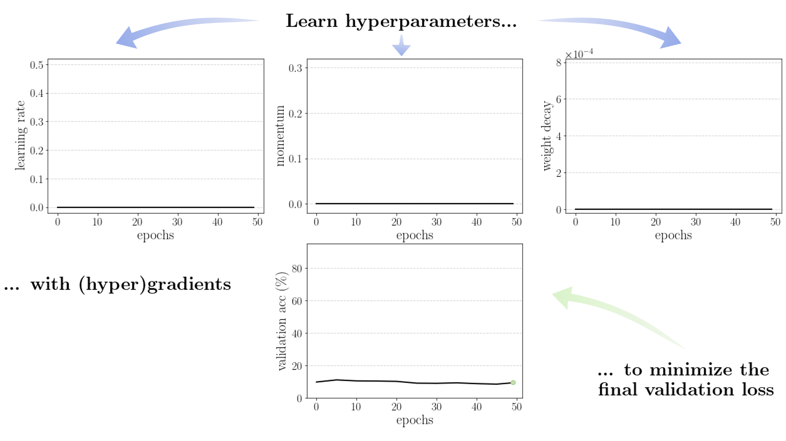

# Gradient-based HPO over Long Horizons

This is accompanying code for the NeurIPS 2021 paper "Gradient-based Hyperparameter Optimization Over Long Horizons" 

## What is this work about? (TLDR)

Our task is to learn hyperparameters with gradients such as learning rate, momentum and weight decay schedules. We use forward mode differentiation, whose memory cost allows us to optimize over large horizon-problems like CIFAR10. Hyperparameter sharing is shown to reduce the error on the hypergradient and mitigate gradient degradation. We can converge to zero-regret hyperparameteres in just ~10 (outer) gradient steps.

## Environment
Tested on:
- Python 3.8
- pytorch 1.9.1 (both cpu and gpu ok)
- torchvision 0.10.1
- numpy 1.20.3

## Run
- The main results from the paper are obtained with the file `main.py`, and the relevant configurations are provided in `scripts/figure1.sh` and `scripts/figure4.sh`
- The results in figure 2 can be recovered using `figure2_hypergradients_fluctuation.py`
- Theorem 4.1 can be checked with `theorem4_proof_checker_simple.py` and `theorem4_proof_checker_advanced.py`

